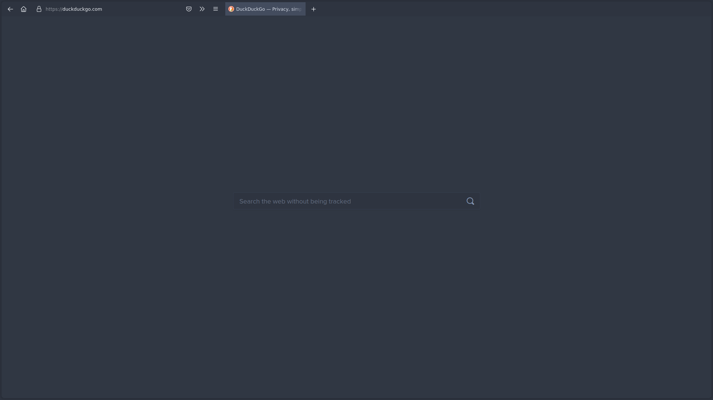
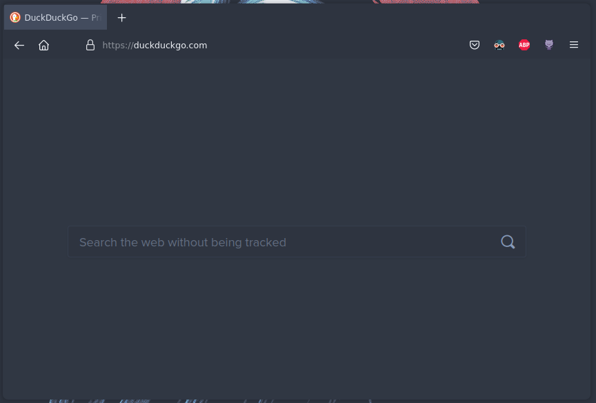

# Nord Waterfall firefox theme

This is a theme taken from the famous [cascade theme](https://github.com/andreasgrafen/cascade) that I modified to have Nord colorscheme.
 
# How to use a userChrome.css theme

1. Type `about:config` into your URL bar. Click on the **I accept the risk** button if you're shown a warning.
2. Seach for **`toolkit.legacyUserProfileCustomizations.stylesheets`**, **`layers.acceleration.force-enabled`**, **`gfx.webrender.all`** and **`svg.context-properties.content.enabled`** and set them to **`true`**.
3. Go to your profile folder:
    - Linux: `$HOME/.mozilla/firefox/######.default-release/`
    - MacOS: `Users/[USERNAME]/Library/Application Support/Firefox/Profiles/######.default-release`
    - Windows: `C:\Users\[USERNAME]\AppData\Roaming\Mozilla\Firefox\Profiles\######.default-release`
4. If it doesn't exist already create a folder called `chrome`.
5. Copy your desired `userChrome.css` into that folder.
6. *optional* Customise everything to your liking.

# Screenshot

